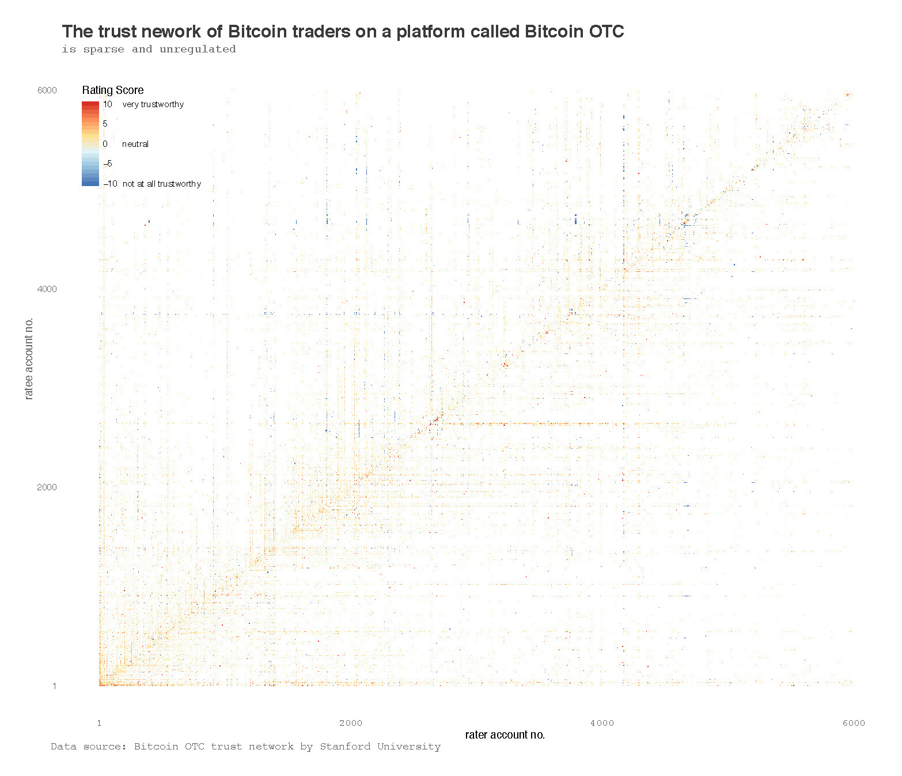
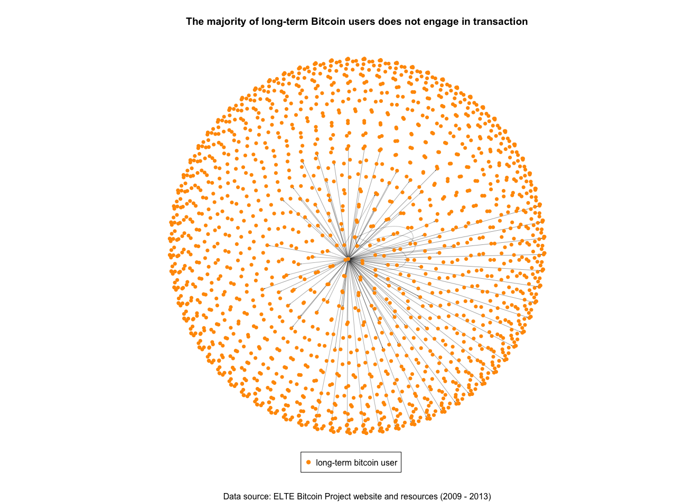

```{r setup, include=FALSE}
knitr::opts_chunk$set(echo = TRUE)
```

```{r, out.width="90px"}

```

```{r, echo=TRUE, include=FALSE}
# install packages
install.packages("easypackages", repos = "http://cran.us.r-project.org")
library(easypackages)
packages("anytime","tidyverse","rmarkdown","readr", "haven", "dplyr", "stringr", "ggplot2", "xts", "igraph", "countrycode", "extrafont", "waffle",
         "rworldmap", "maps")

# set master theme
# ISSUE: Not generalized enough.
theme_jiye <- theme(panel.grid.major.y =element_line( size=.1, color="#999999"),
                    panel.grid.major.x = element_blank(),
                    panel.background = element_blank(),
                    plot.title = element_text(size=24,
                                              family = "Helvetica",
                                              colour = "#3a3a3a",
                                              face = "bold"),
                    plot.subtitle = element_text(size=10,
                                                 family = "Avenir",
                                                 colour = "#666666"),
                    axis.title.y = element_text(colour="#325a8c"),
                    axis.title.x = element_blank(),
                    axis.text.y = element_text(colour="#325a8c"),
                    axis.text.x = element_text(size=12,
                                                family = "Avenir",
                                                colour = "#666666"
                                                ),
                    axis.ticks.y = element_blank(),
#                    axis.ticks.x = element_blank(),
                    legend.position = "none",
                    plot.caption = element_text(size=8,
                                                family = "Avenir",
                                                colour = "#666666",
                                                hjust = 0
                                                ),
                    plot.margin = unit(c(0,0,0,0), "cm"))

# Load data
#   graph one data
btc_price = read_csv("./data/BCHAIN-MKPRU.csv") # as of 10-21
btc_price <- mutate(btc_price, Date = as.POSIXct(Date))

#   graph 2-1 data
nodes = read_csv("./data/20171021_nodes.csv")
nodes <- mutate(nodes, country = countrycode(country_code,
                                             origin="iso2c",
                                             destination = "country.name.en"))

# graph 2-2 data
# I have a full nodes dataset pulled from BitNodes, but for this graph
# data has to be hand-typed here thanks to waffle package requirement.
# It's great.
nation_list <- c(`U.S.A (2962)`=2962,
                `Germany (1716)`=1716,
                `France (665)`=665,
                `Netherlands (519)`=519,
                `China (511)`=511,
                `Canada (431)`=431,
                `U.K. & Northern Ireland (362)`=362,
                `Russian Federation (334)`=334,
                `Singapore (217)`=217,
                `Ireland (201)`=201,
                `Australia (149)`=149,
                `Japan (138)`=138,
                `Switzerland (138)`=138,
                `Sweden (131)`=131,
                `Hong Kong (102)`=102,
                `Rest of the World (1397)`=1397)

# Alternative graph 2-2 data
top_country_nodes = read_csv("./data/country_list_topOnly.csv")

#   graph three data
# ISSUE: Should update this dataset for all platforms.
# note: this graph should show correlation between price rise with buying interests.
# get trading volume by coin by left_join volume_usd with price
coinbase = read_csv("./data/coinbaseUSD.csv")
colnames(coinbase) = c("unix_timestamp", "price", "volume_btc")
                         
# Convert unix timestamp to human-readable date & time
coinbase <- mutate(coinbase, unix_timestamp = anytime(unix_timestamp))
coinbase <- mutate(coinbase, volume_usd = volume_btc * price)

# sample down to 1 percent
coinbase_lim <- sample_frac(coinbase, size = 0.01)

ts <- xts(coinbase_lim$volume_usd, as.Date(coinbase_lim$unix_timestamp, "%Y-%m-%d"))
ts_d = apply.daily(ts, FUN=sum)
#ts_m = apply.monthly(ts_d, FUN=sum)
df_d <- data.frame(date=index(ts_d), coredata(ts_d))
colnames(df_d) <- c("date", "volume_usd")

ts_btc <- xts(coinbase_lim$volume_btc, as.Date(coinbase_lim$unix_timestamp, "%Y-%m-%d"))
ts_d_btc = apply.daily(ts_btc, FUN=sum)
#ts_m_btc = apply.monthly(ts_d_btc, FUN=sum)
df_d_btc <- data.frame(date=index(ts_d_btc), coredata(ts_d_btc))
colnames(df_d_btc) <- c("date", "volume_btc")

df <- left_join(df_d, df_d_btc)

df_btc <- df[, c("date", "volume_btc")]
df_btc$unit <- "Bitcoin"
colnames(df_btc) <- c("date", "volume", "unit")

df_usd <- df[, c("date", "volume_usd")]
df_usd <- mutate(df_usd, volume_usd = volume_usd/1000)
df_usd$unit <- "Thousand USD"
colnames(df_usd) <- c("date", "volume", "unit")

agg <- rbind(df_btc, df_usd)
#volume_usd <- read_csv("./data/20171018_Bitcoin USD Exchange Trading Volume.csv")
#volume_usd <- mutate(volume_usd, Date = as.POSIXct(Date))
#volume_usd$unit <- "USD"

#volume_usd <- mutate(volume_coin, unit = "USD")

#agg <- left_join(x=volume_usd, y=btc_price, by="Date")
#colnames(agg) <- c("Date", "volume_usd", "price_usd")
#agg <- mutate(agg, volume_coin = volume_usd/price_usd)

# ISSUE: (RESOLVED) what is the difference betwen <- and = ?
#        arrow is directional and therefore clearer.
#colnames(volume_agg) <- c("Date", "volume_coin", "volume_usd")

#   graph four data
soc <- read_csv("./data/soc-sign-bitcoinotc.csv", col_names = c("rater", "ratee", "score", "rate_timestamp"))
#   graph five data
links <- read_tsv("./data/lt_graph_ELTE.txt", col_names = c("sender", "recipient", "transaction_timestamp"))
```

### Introduction

There are several advantages to dedicate a data visualization portfolio and 10-week effort to digital currency:

* Massive and Robust data source: Blockchain is a public transaction log
  that exists as a distributed database, validated by its powerful algorithm.
    
* Fitting data types: Blockchain data includes time and IP addresses, and 
  can be updated frequently, which means it is useful for both the static and
  dynamic data visualizations.
    
* Well-supported: I can save the entire blockchain file locally,use 
  community-maintained tools to parse it, and keep the data up-to-date.
    
* Policy-setting: Digital currencies are being used as store of value to 
fight inflation in turbulent economies such as Zimbabwe and Latin American
countries. Central Banks are issuing experimental policies in response to 
the dessemination of digital currency and blockchain technology.
    
This paper will explore some data sources published by major Bitcoin exchanges and platforms as an market overview.


``` {r, dpi=200}
# ISSUE: what is target user's viewing device and optimum dpi?
# ISSUE: Should probably change x tick label to lighter grey.
rectangle <- data.frame(xmin = as.POSIXct(c("2017-03-25")),
                        xmax = as.POSIXct(c("2017-10-21")),
                        ymin = 0,
                        ymax = Inf)

line <- ggplot(data=btc_price) +
  geom_line(size=.25,
            aes(Date, Value),
            color="#325a8c") +
  geom_vline(xintercept = as.POSIXct("2017-03-25"),
             colour="#ff7575",
             size=.5,
             linetype="dotted",
             alpha=.75) +
  scale_y_continuous(name ="Bitcoin Market Price in USD",
                     breaks = (seq(0,6000,1000))
                     ) +
  scale_x_datetime(date_breaks = "1 year",
                   labels = seq(2009,2018,1),
                   expand=c(0,0)) +
  ggtitle("Bitcoin Price",
          subtitle = "experienced the greatest surge in history this year") +
  labs(caption = "Source: Blockchain.com") +
  annotate(geom="text",
           x=as.POSIXct("2016-01-15"),
           y=2200,
           label="Surge started on Mar 25, 2017",
           colour="#ff7575",
           family="Avenir",
           fontface="bold",
           alpha=1) +
  theme_jiye

line + geom_rect(data = rectangle, aes(xmin = xmin, xmax = xmax, ymin = ymin, ymax = ymax),
                 fill = "#ff7575", alpha = 0.1)
```

<br/>

### Bitcoin price is volatile

The price of bitcoin can increase or decrease drastically over a
short period of time. This graph mainly serves as a priliminary 
evidence to pinpoint certain time points where a new policy or
event may have impacted the price of Bitcoin.

<br/>

```{r, dpi=200, fig.asp=.65}
# graph 2-1: nodes map
# map theme
theme_map <- theme(panel.grid.major.y = element_blank(),
                    panel.grid.major.x = element_blank(),
                    panel.background = element_blank(),
                    plot.title = element_text(size=24,
                                              family = "Helvetica",
                                              colour = "#3a3a3a",
                                              face = "bold"),
                    plot.subtitle = element_text(size=12,
                                                 family = "Avenir",
                                                 colour = "#666666"),
                    axis.title.y = element_blank(),
                    axis.title.x = element_blank(),
                    axis.text.y = element_blank(),
                    axis.text.x = element_blank(),
                    axis.ticks.y = element_blank(),
                                        axis.ticks.x = element_blank(),
                    legend.position = "none",
                    plot.caption = element_text(size=8,
                                                family = "Avenir",
                                                colour = "#666666",
                                                hjust = 0
                    ),
                    plot.margin = unit(c(1,0,0,0), "cm"))

# ISSUE: How to color code by country's node count?
# ISSUE: The map projection method is visibly elongated for tropical areas.
# ISSUE: (RESOLVED)How to remove Antarctica? 
mp <- NULL
mapWorld <- borders("world", colour="#FFFFFF", fill='grey75', alpha=0.6,
                    ylim = c(-50, 70)) # create a layer of borders
mp <- ggplot() + mapWorld

# Now Layer the cities on top
mp <- mp+ geom_point(aes(x=nodes$longitude, y=nodes$latitude) ,color="#fe5346", size=0.75, alpha=.25) + 
  geom_path(aes(x=nodes$longitude, y=nodes$latitude), color="#FF9900", size=.1, alpha=0.025,
            linejoin = "bevel") +
  ggtitle("Global Nodes Distribution",
          subtitle = "is uneven across continents") +
  labs(caption = "Source: BitNodes API") +
  theme_map
mp
```

```{r, dpi=200}
# graph 2-2: waffle chart
nation_cols <- c(
                "#93B7BE","#584F50","#b3906a","#FF991C",'#fb4d3d',
                '#ff9b9b','#313E50','#78323e','#20FC8F','#90E0F3',
                '#5b8e7d','#ffb7c5','#CFB53B','#769855','#e13224',
                "#CCCCCC"
                )

waffle <- waffle(nation_list%/%100,
       rows=3,
       size=1.5,
       colors=nation_cols,
       legend_pos = "bottom",
       xlab="Total nodes as of Oct 18, 2017 (9973)",
       title='Bitcoin Nodes Distribution by Countries (source: BitNodes API)')
waffle
```

```{r, fig.width=16,dpi=200}
# Alternative graph 2-2: percentage bar
# graph 2 alt: stacked percentage bar

#locks factor level
top_country_nodes$country <- factor(top_country_nodes$country, levels = top_country_nodes$country)

# ISSUE: Hard coded data, should fix soon.
# ISSUE: Ugly legend or insufficient legend?
# ISSUE: (RESOLVED) don't know how to right-ligh axis tick label.
nation_cols2 <- c(
                "#93B7BE","#584F50","#b3906a","#FF991C",'#fb4d3d',
                "#999999","#999999","#999999","#999999","#999999",
                "#999999","#999999","#999999","#999999","#999999",
                "#dddddd"
                )
perc_bar <- ggplot(data = top_country_nodes, aes(x="", y = node, fill=factor(country))) + 
  geom_bar(stat='identity', position = position_stack(reverse = TRUE), width=.75, colour="white") +
  coord_flip() +
  scale_fill_manual(values=nation_cols2) +
  theme(panel.grid.major.y =element_blank(),
                    aspect.ratio = 0.05,
                    panel.grid.major.x = element_blank(),
                    panel.background = element_blank(),
                    plot.title = element_text(size=24,
                                              family = "Helvetica",
                                              colour = "#3a3a3a",
                                              face = "bold"),
                    plot.subtitle = element_text(size = 12,
                                                 family = "Avenir",
                                                 colour = "#666666"),
                    axis.title.y=element_blank(),            
                    axis.title.x = element_blank(),
                    axis.text.x = element_text(colour="#666666", family = "Avenir", hjust = 1, size=10), # inverted axis
                    axis.ticks.y = element_blank(),
                    legend.position = "none",
                    axis.line.x = element_line(),
                    plot.caption = element_text(size=12,
                                                family = "Avenir",
                                                colour = "#666666",
                                                hjust = 0
                                                ),
                    plot.margin = unit(c(0,2,0,1), "cm"))
perc_bar + scale_y_continuous(name="",labels=c("0%", "USA\n29.62%", "Germany\n17.16%", "France\n6.65%", "Netherlands\n5.19%", "China\n5.11%", "< Countries with over 100 nodes", "Rest of the World\n13.97%"),
                     breaks = (c(0, 2962, (2962+1716), (2962+1716+665), (2962+1716+665+519), (2962+1716+665+519+511),9973-1397,
                              sum(top_country_nodes$node))),
                     expand=c(0,0)
                     ) +
                     labs(caption = "Source: BitNodes") +
  ggtitle("Blockchain Network is Distributed",
          subtitle = " in high GDP countries, with the Middle East underrepresented")
```

### (ISSUE: REWRITE THIS) Nodes, nodes-nodes, Nodes?
Lorem ipsum dolor sit amet, consectetuer adipiscing elit. Aenean commodo ligula eget dolor. Aenean massa. Cum sociis natoque penatibus et magnis dis parturient montes, nascetur ridiculus mus. Donec quam felis, ultricies nec, pellentesque eu, pretium quis, sem. Nulla consequat massa quis enim. Donec pede justo, fringilla vel, aliquet nec, vulputate eget, arcu. In enim justo, rhoncus ut, imperdiet a, venenatis vitae, justo. Nullam dictum felis eu pede mollis pretium. Integer tincidunt. Cras dapibus. Vivamus elementum semper nisi. Aenean vulputate eleifend tellus. Aenean leo ligula, porttitor eu, consequat vitae, eleifend ac, enim. Aliquam lorem ante, dapibus in, viverra quis, feugiat a, tellus. 

<br/>


```{r, fig.width = 16, fig.height = 12}
# note: color #85bb65 is nicknamed as "dollar bill green".
#       color #FF9900 is the orange from bitcoin logo.
# ISSUE:Both colors are ugly af, switch soon.
area <- ggplot(data=agg, aes(x = as.POSIXct(date), y = volume, fill = as.factor(unit))) +
  geom_area(position = "stack") +
  scale_x_datetime(date_breaks = "3 months", expand=c(0,0)) +
  scale_y_continuous(breaks = c(0, 250, 500, 750, 1000, 2000, 3000)) + 
  scale_fill_manual(values = alpha(c("#FF9900", "#85bb65")), 0.2) +
  ggtitle("Bitcoin Daily Trading Volume",
          subtitle = "in number of bitcoin & Thousands of USD") +
  labs(caption = "Source: Coinbase API",
       x = "",
       y = "Volume") +
  theme(panel.grid.major.y =element_line( size=.1, color="#999999"),
                    panel.grid.major.x = element_blank(),
                    panel.background = element_blank(),
                    plot.title = element_text(size=24,
                                              family = "Helvetica",
                                              colour = "#3a3a3a",
                                              face = "bold"),
                    plot.subtitle = element_text(size=12,
                                                 family = "Avenir",
                                                 colour = "#666666"),
                    #axis.title.y = element_text(colour="#325a8c"),
                    axis.title.x = element_blank(),
                    #axis.text.y = element_text(colour="#325a8c"),
#                    axis.text.x = element_blank(),
                    axis.ticks.y = element_blank(),
#                    axis.ticks.x = element_blank(),
                    legend.position = "none",
                    plot.caption = element_text(size=8,
                                                family = "Avenir",
                                                colour = "#666666",
                                                hjust = 0
                                                ),
                    plot.margin = unit(c(0,0,0,0), "cm"))

area
```

### (ISSUE: Rewrite) High Trading Volume Volatility:
(Should discuss how the price peaks usually precedes bitcoin peaks, discuss
irational buying behavior, market optimism, etc.)
In this graph, we can see that bitcoin's daily trading volume is extremely
volatile, perhaps even more so than its price. This level of volatility can
be a sign for market manipulation, especially given Bitcoin's young economy,
novel nature, and lack of regulation. Together with the price trend, this 
graph can help identify major policy changes that either encourage (spike)
or discourage (trough) speculation.

```{r, eval=FALSE, dpi=200, fig.width=12}
# View in full screen for clarity.
# ISSUE: Probably shouldn't use Heatmap.
# ISSUE: Needs more deliberate, consistent color scheme
heatmap <- ggplot(soc, aes(x=rater, y=ratee, fill=score)) + geom_tile() +
  scale_fill_distiller(type="div", palette = "RdYlBu") +
  ggtitle("The trust nework of Bitcoin traders",
          subtitle = "is sparse and unregulated") +
  labs(caption = "Source: Bitcoin OTC trust network by Stanford University") +
  theme(panel.grid.major.y = element_blank(),
        aspect.ratio = 1,
                    panel.grid.major.x = element_blank(),
                    panel.background = element_blank(),
                    plot.title = element_text(size=24,
                                              family = "Helvetica",
                                              colour = "#3a3a3a",
                                              face = "bold"),
                    plot.subtitle = element_text(size=12,
                                                 family = "Avenir",
                                                 colour = "#666666"),
                    #axis.title.y = element_text(colour="#325a8c"),
                    axis.title.x = element_blank(),
                    #axis.text.y = element_text(colour="#325a8c"),
#                    axis.text.x = element_blank(),
                    axis.ticks.y = element_blank(),
#                    axis.ticks.x = element_blank(),
                    legend.position = "none",
                    plot.caption = element_text(size=8,
                                                family = "Avenir",
                                                colour = "#666666",
                                                hjust = 0
                                                ),
                    plot.margin = unit(c(0,0,0,0), "cm"))
heatmap
```



### The Who-trust-whom Network:
While sparse and barely visible, this graph does provide some
insights about the Bitcoin market. First, it allows us to identify

some super raters and ratees, who are more likely to be the major
player capable of manipulating Bitcoin price. Second, although orange
(trustworthy) is more prevalent, there are quite a few blue spots 
on this heatmap, marking the users that are rated as fraud by others.
At a glimpse, fraud is frequent in digital currency market, which
underscores its unregulated nature.

```{r, eval=FALSE}
# ISSUE: cannot knit this code chunk
net <- graph_from_data_frame(d=links, directed = T)

# set color
col.1 <- adjustcolor("#666666", alpha=0.4)
col.2 <- adjustcolor("#000000", alpha=0.4)
#edge.pal <- colorRampPalette(c(col.1, col.2))#, alpha = TRUE)
#edge.col <- edge.pal(100)
edge.col <- col.1

colrs_transparent <- adjustcolor("#FFFFFF", alpha=0)

net_simplified <- simplify(net,remove.multiple = F,edge.attr.comb=list(Weight="sum"), remove.loops = T)
l <- layout_on_sphere(net_simplified)
plot(net_simplified,
     layout=l,
     edge.arrow.size=0.1,
     vertex.size=2,
     vertex.color="#FF9900",
     #vertex.frame.color=colrs_transparent,
     vertex.label=NA,
     edge.color="grey50",
     main="The majority of long-term Bitcoin users does not engage in transaction",
     sub="Data source: ELTE Bitcoin Project website and resources (2009 - 2013)"
     )
legend(x=-0.3, y=-1.1, c("long-term bitcoin user"), col="#FF9900", pch=21, pt.bg="#FF9900")
```




### Low Liquidity:

This is a graph that visualizes the transaction activities of several
thousand long-term Bitcoin users during 2009 - 2013. We can see that
the majority is inactive, with one user radiating assets to many others,
and a few others repeatedly send money to themselves. Not only can this
network graph serves as a piece of evidence to show that most people 
purcahse Bitcoin for the purpose of speculation, it also shows that, 
while the technological philosophy of Bitcoin is decentralization,
its ownership and commercial activity is very much the opposite.

```{r, out.width="100px"}

```


